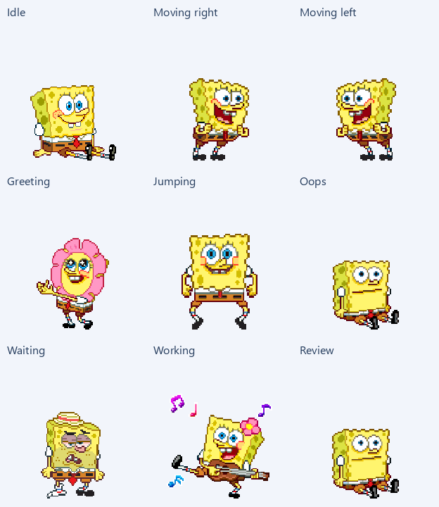
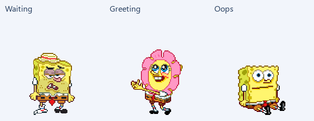

# Spongey Boy

A custom pixel-art companion for Codex, assembled from existing SpongeBob GIF frames without image generation.

## Install

1. Download this repository with **Code → Download ZIP**, then extract it.
2. Create a folder named `spongey-boy` inside your Codex pets folder:
   - Windows: `%USERPROFILE%\.codex\pets\spongey-boy\`
   - macOS or Linux: `~/.codex/pets/spongey-boy/`
3. Copy **pet.json** and **spritesheet.webp** from this repository into that folder.
4. In Codex, open **Settings → Pets**, select **Refresh**, then choose **Spongey Boy**.

If you have set `CODEX_HOME`, use its `pets/spongey-boy` subfolder instead. The PNG is an editable copy; the WebP is the runtime file.

## Animations

| State | Pose | Frames |
| --- | --- | ---: |
| Idle | Seated smile | 6 |
| Moving right | Turning and leaning | 8 |
| Moving left | Mirrored turning and leaning | 8 |
| Greeting | Flower-costume gestures | 4 |
| Jumping | Squat and arms-up poses | 5 |
| Oops | Frightened expression and ghost | 8 |
| Waiting | Tired hat and reaching gesture | 6 |
| Working | Guitar playing | 6 |
| Review | Seated blinking | 6 |

The corrected waiting sequence uses a shared scale. The greeting is smaller, and Spongey Boy stays centred while the ghost moves during Oops.

## Files and editing

- `pet.json` and `spritesheet.webp`: the two files needed to install the pet.
- `spritesheet.png`: lossless editable atlas.
- `frames/`: all 57 prepared transparent PNG frames, grouped by state.
- `animation-mapping.json`: row order, timing, source-frame provenance, and resizing information.
- `previews/`: individual animated states, the full preview, and a labelled contact sheet.
- `qa/`: validation and visual-review reports for this version.
- `scripts/build_pet.py`: rebuilds the atlas from the included frames using Pillow.

The pet uses the v1 format: **8 columns × 9 rows**, **192 × 208** pixel cells, and a **1536 × 1872** pixel atlas. Unused cells remain transparent. It has no pointer-controlled gaze rows. Movement uses existing turning poses rather than a newly drawn walking cycle.

To rebuild after editing a frame, install Pillow (`python -m pip install Pillow`) and run `python scripts/build_pet.py` from the repository folder. Reinstall the updated WebP and refresh Pets afterward.

The character artwork was supplied as GIF references. This repository packages those existing frames as an unofficial custom pet; no artwork was generated or redrawn.
